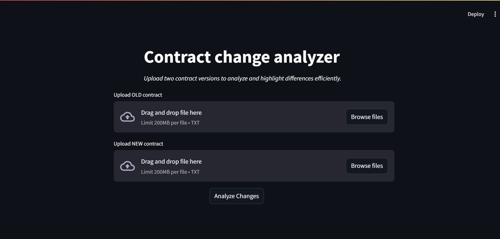

# 📄 Contract Change Analyzer

A lightweight web application that compares two versions of a contract and highlights differences in a structured and visually intuitive way. Built using Streamlit and Python, this tool helps users quickly identify added, removed, and modified content.

## Features
- Upload two contract files (.txt)

- Line-by-line comparison

- 🟥 Highlights removed/changed lines (Old Contract)

- 🟩 Highlights added/updated lines (New Contract)

- ⚖️ Handles unequal file lengths (extra lines detection)

-  Clean side-by-side comparison UI

## How It Works
- Files are uploaded and read as text

- Text is split into lines for structured comparison

- Matching lines are compared using Python logic

- Differences are highlighted:

   Red → Removed/changed content
  
   Green → Added/updated content
  
- Extra lines are handled separately to maintain alignment

## 🛠️Tech Stack
- Python
- Streamlit
- HTML styling (for colored diff display)

## Demo

https://contract-change-detection-system.streamlit.app/

## 📦Installation & Run
git clone https://github.com/your-username/contract-change-analyzer.git

cd contract-change-analyzer

pip install -r requirements.txt

streamlit run app.py

## Use Cases
- Legal contract comparison
- Document version tracking
- Academic/project document changes
- Quick diff tool for text files

## Future Improvements
- Word-level difference highlighting
- Support for PDF/DOCX files
- Downloadable comparison reports
- Enhanced UI/UX

## Author
Vandana

## Project Status
- Completed (MVP)
- Open for enhancements

